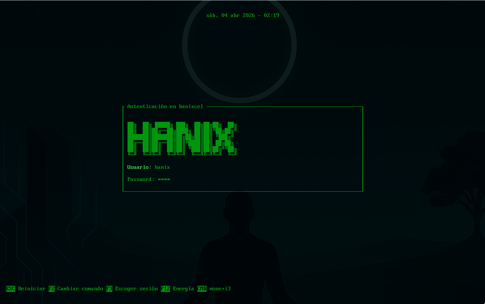
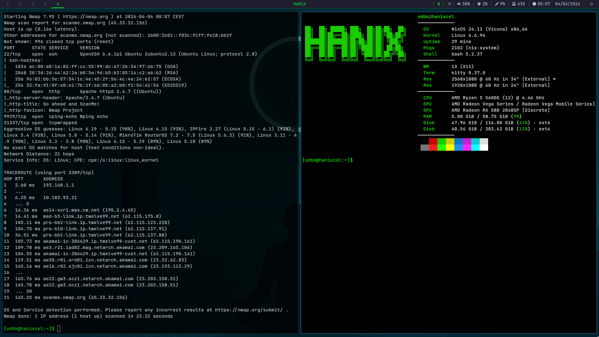

# HaNiX

NixOS flake orientado a hacking y ciberseguridad — entorno hacker con i3, polybar, greetd y nixvim, con más de 50 herramientas de seguridad preinstaladas y configuradas.





## Herramientas de seguridad incluidas

### Explotación y Post-explotación
`metasploit` `sqlmap` `exploitdb` `msfpc` `netexec` `smbmap` `enum4linux`

### Escaneo y Reconocimiento
`nmap` `masscan` `amass` `subfinder` `theharvester` `dnsenum` `whatweb` `nikto` `gobuster` `ffuf` `dirb` `dirbuster` `burpsuite` `caido`

### Ingeniería Inversa y Análisis Binario
`ghidra` `radare2` `cutter` `binwalk` `gdb` `pwndbg` `ltrace` `strace` `checksec`

### Criptografía y Fuerza Bruta
`hashcat` `john` `thc-hydra` `cewl` `crunch` `wfuzz` `seclists` `rockyou` `wordlists`

### Red y MITM
`wireshark` `ettercap` `mitmproxy` `bettercap` `responder` `tcpdump` `dsniff` `socat` `aircrack-ng` `pixiewps` `wifite2`

## Entorno de escritorio

- **i3** con gaps y picom (transparencias/blur)
- **Polybar** tema matrix verde — bluetooth, wifi, volumen, CPU, RAM, disco, updates, power menu
- **greetd + tuigreet** con ASCII art HaNiX en el login
- **Rofi** launcher estilo hacker
- **Nixvim** neovim declarativo (catppuccin mocha, LSP, treesitter, cmp...)
- **Fastfetch** al abrir terminal
- Bootloader **auto-detectado** (systemd-boot en UEFI, GRUB en BIOS)

## Instalación

### 0. Requisitos previos (instalación fresca de NixOS)

Tras instalar NixOS base, habilita flakes y git:

```bash
nix-shell -p git
```

O de forma permanente añade a `/etc/nixos/configuration.nix`:

```nix
nix.settings.experimental-features = [ "nix-command" "flakes" ];
environment.systemPackages = [ pkgs.git ];
```

```bash
sudo nixos-rebuild switch
```

### 1. Clonar

```bash
git clone https://github.com/odbk/hanix
cd hanix
```

### 2. Configuración personal

Edita `shared/personal.nix` con tu usuario:

```nix
{ ... }: {
  hanix.mainUser = "tuusuario";

  # Opcional — si clonaste en otro directorio:
  # hanix.flakePath = "/home/tuusuario/hanix";

  # Opcional — disco para GRUB en sistemas BIOS (por defecto /dev/sda):
  # hanix.grubDevice = "/dev/sda";
}
```

Activa skip-worktree para que git no suba tus datos:

```bash
git update-index --skip-worktree shared/personal.nix
```

### 3. Aplicar

```bash
./rebuild
```

El script copia automáticamente tu `hardware-configuration.nix`, detecta si el sistema es UEFI o BIOS y aplica la configuración.

## Estructura

```
flake.nix                  # entradas y configuraciones
rebuild                    # script de instalación/actualización
hardware-configuration.nix # generado automáticamente por ./rebuild (gitignored)
shared/
  configuration.nix        # base del sistema (audio, locale, bluetooth, bootloader...)
  appearance.nix           # entorno gráfico (i3, polybar, greetd, fuentes...)
  essentials.nix           # paquetes esenciales (thunar, docker, gvfs...)
  extras.nix               # utilidades extra (telegram, discord, vlc...)
  hacking.nix              # +50 herramientas de seguridad
  nixvim.nix               # configuración declarativa de neovim
  default-user.nix         # define el usuario según hanix.mainUser
  user-option.nix          # opciones hanix.* (mainUser, flakePath, grubDevice)
  personal.nix             # ← TU config privada (skip-worktree, no se sube)
  .config/                 # dotfiles (i3, polybar, rofi, picom, fastfetch...)
```

## Opciones personalizables

| Opción | Por defecto | Descripción |
|--------|-------------|-------------|
| `hanix.mainUser` | `"hanix"` | Nombre del usuario principal |
| `hanix.flakePath` | `/home/<user>/hanixpkg` | Ruta al repo (para el alias `rebuild`) |
| `hanix.grubDevice` | `"/dev/sda"` | Disco de instalación GRUB (solo sistemas BIOS) |
