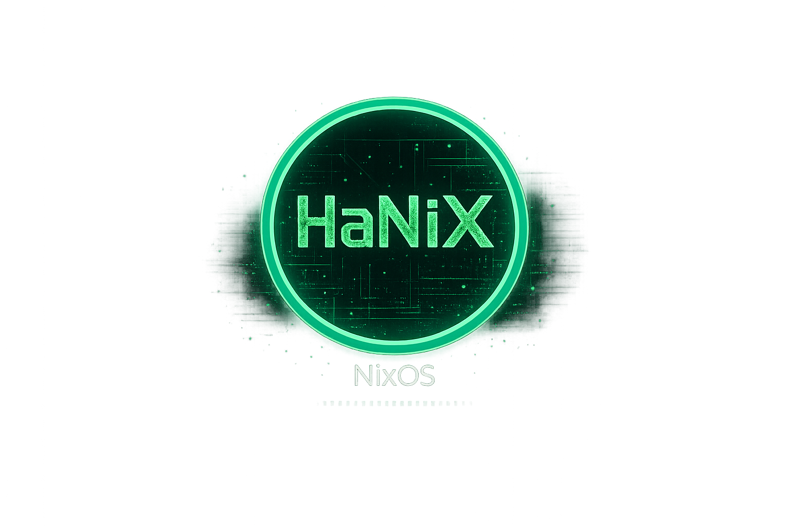

<p align="center">
  
</p>

<p align="center">
  NixOS flake orientado a hacking y ciberseguridad — entorno hacker con i3, polybar, greetd y nixvim,<br>
  con más de 50 herramientas de seguridad preinstaladas y boot splash personalizado.
</p>

---

## Screenshots

> ⚠️ Screenshots pendientes de actualizar

## Entorno de escritorio

- **i3** con gaps y picom (transparencias/blur)
- **Polybar** tema matrix verde
  - Barra superior: workspaces · CPU · RAM · disco (click = popup de uso) · red · volumen · updates · power menu
  - Barra inferior: IPs activas (click = copiar + notificación) · system tray
- **greetd + tuigreet** login TUI con ASCII art HaNiX
- **Plymouth** boot splash con logo HaNiX personalizado + barra de progreso verde
- **GTK** tema catppuccin mocha verde (Thunar, geany, pavucontrol...)
- **Rofi** launcher y modales estilo hacker
- **Nixvim** neovim declarativo (catppuccin mocha, LSP, treesitter, cmp...)
- **Fastfetch** con logo al abrir terminal
- **tmux** con barra de estado verde matrix (prefix `Ctrl+a`)
- **dunst** notificaciones — VPN conectada/desconectada automáticamente
- **udiskie** automontaje de USBs con notificación
- **flameshot** capturas (`Print` = completa, `mod+p` = área, `mod+Shift+p` = anotaciones)
- **i3lock-color** pantalla de bloqueo con logo HaNiX (`mod+Escape`)
- Bootloader **auto-detectado** (systemd-boot UEFI / GRUB BIOS)

## Herramientas de seguridad incluidas

### Explotación y Post-explotación
`metasploit` `sqlmap` `exploitdb` `msfpc` `netexec` `smbmap` `enum4linux`

### Escaneo y Reconocimiento
`nmap` `masscan` `amass` `subfinder` `theharvester` `dnsenum` `whatweb` `nikto` `gobuster` `ffuf` `feroxbuster` `dirb` `dirbuster` `burpsuite` `caido` `nuclei` `sslscan`

### Active Directory y Windows
`bloodhound` `evil-winrm` `kerbrute`

### Ingeniería Inversa y Análisis Binario
`ghidra` `radare2` `cutter` `binwalk` `gdb` `pwndbg` `ltrace` `strace` `checksec`

### Criptografía y Fuerza Bruta
`hashcat` `john` `thc-hydra` `cewl` `crunch` `wfuzz` `seclists` `rockyou` `wordlists`

### Red, MITM y Pivoting
`wireshark` `ettercap` `mitmproxy` `bettercap` `responder` `tcpdump` `dsniff` `socat` `ligolo-ng` `aircrack-ng` `pixiewps` `wifite2`

### Anonimato y Proxies
`tor` `proxychains`

## Instalación

### 0. Requisitos previos (instalación fresca de NixOS)

```bash
nix-shell -p git
```

O de forma permanente en `/etc/nixos/configuration.nix`:

```nix
nix.settings.experimental-features = [ "nix-command" "flakes" ];
environment.systemPackages = [ pkgs.git ];
```

```bash
sudo nixos-rebuild switch
```

### 1. Clonar

```bash
git clone https://github.com/odbk/hanix
cd hanix
```

### 2. Setup inicial

```bash
./setup
```

Crea los directorios estándar (`~/Images`, `~/CTF`, `~/Hacking`...) y marca `personal.nix` como skip-worktree.

### 3. Configuración personal

Edita `shared/personal.nix`:

```nix
{ ... }: {
  hanix.mainUser = "tuusuario";

  # GPU para Plymouth (sin esto el boot splash no se muestra)
  # Pon el módulo de tu tarjeta gráfica: amdgpu, i915, nouveau, radeon
  hanix.plymouthGpuModules = [ "amdgpu" ];

  # Opcional — si clonaste en otro directorio:
  # hanix.flakePath = "/home/tuusuario/hanix";

  # Opcional — disco para GRUB en sistemas BIOS (por defecto /dev/sda):
  # hanix.grubDevice = "/dev/sda";
}
```

Activa skip-worktree para que git no suba tus datos:

```bash
git update-index --skip-worktree shared/personal.nix
```

### 4. Aplicar

```bash
./rebuild
```

El script copia automáticamente tu `hardware-configuration.nix`, detecta si el sistema es UEFI o BIOS y aplica la configuración.

> Para que el boot splash Plymouth aparezca en el primer arranque usa `./rebuild boot` en lugar de `./rebuild`.

## Estructura

```
flake.nix                    # entradas y configuraciones
rebuild                      # script de instalación/actualización
setup                        # script de configuración inicial (ejecutar antes del primer rebuild)
hardware-configuration.nix   # generado automáticamente por ./rebuild (gitignored)
shared/
  configuration.nix          # base del sistema (audio, locale, bluetooth, bootloader, aliases...)
  essentials.nix             # servicios y paquetes core (thunar, docker, gvfs, xdg defaults...)
  extras.nix                 # software adicional (telegram, discord, vlc...)
  hacking.nix                # +50 herramientas de seguridad
  default-user.nix           # define el usuario según hanix.mainUser
  user-option.nix            # opciones hanix.* personalizables
  personal.nix               # ← TU config privada (skip-worktree, no se sube)
  themes/
    appearance.nix           # entorno gráfico (i3, polybar, greetd, GTK, fuentes, dotfiles sync)
    plymouth.nix             # boot splash HaNiX
    nixvim.nix               # neovim declarativo
    plymouth/hanix/          # assets del tema Plymouth (logo, script)
  images/
    boot.png                 # logo HaNiX original
  .config/                   # dotfiles (i3, polybar, rofi, dunst, tmux, fastfetch...)
```

## Opciones personalizables (`personal.nix`)

| Opción | Por defecto | Descripción |
|--------|-------------|-------------|
| `hanix.mainUser` | `"hanix"` | Nombre del usuario principal |
| `hanix.flakePath` | `/home/<user>/hanixpkg` | Ruta al repo (para el alias `rebuild`) |
| `hanix.grubDevice` | `"/dev/sda"` | Disco de instalación GRUB (solo sistemas BIOS) |
| `hanix.plymouthGpuModules` | `[]` | Módulos KMS para el boot splash (`amdgpu`, `i915`, `nouveau`...) |
