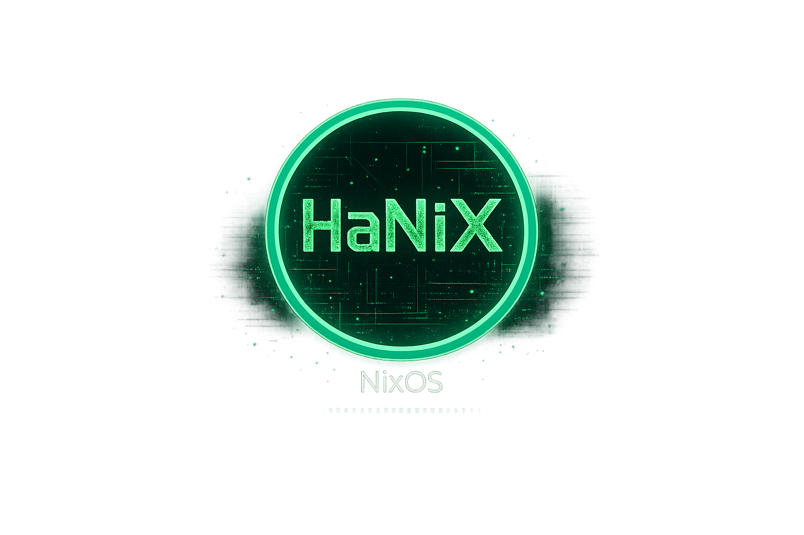
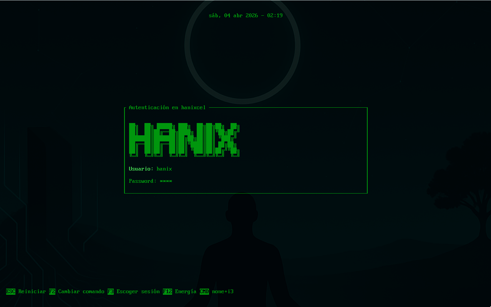
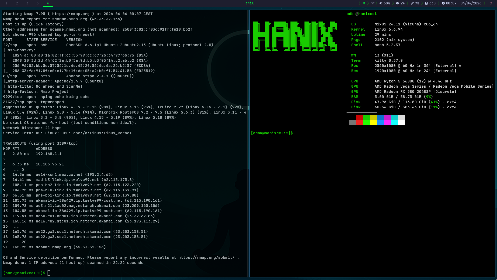

<p align="center">
  
</p>

<p align="center">
  <strong>Español</strong> · <a href="README.en.md">English</a>
</p>

<p align="center">
  NixOS 25.11 flake orientado a hacking y ciberseguridad — entorno hacker con i3, Polybar y greetd,<br>
  con más de 100 herramientas de seguridad preinstaladas, boot splash personalizado y una<br>
  <strong>IA local (offline) que escribe y explica comandos para aprender</strong>.
</p>

---

## Screenshots

| Login | Desktop | Shell |
|-------|---------|-------|
|  |  |  |

## Entorno de escritorio

- **i3** con gaps y picom (transparencias/blur)
- **Polybar** tema matrix verde
  - Barra superior: workspaces · CPU · RAM · disco (click = popup de uso) · red · volumen · updates · power menu
  - Barra inferior: IPs activas (click = copiar + notificación) · system tray
- **greetd + tuigreet** login TUI con ASCII art HaNiX
- **Plymouth** boot splash con logo HaNiX personalizado + barra de progreso verde
- **GTK** tema catppuccin mocha verde (Thunar, Geany, pavucontrol...)
- **Thunar + Xfconf** con vistas, preferencias, miniaturas y plugins persistentes
- **IAnix** IA local (offline) que escribe y explica comandos en tu idioma; con `-v` detalla cada argumento
- **Rofi** launcher y modales estilo hacker
- **VS Code y Geany** para edición, además de Kitty, Alacritty y Foot
- **Fastfetch** con logo al abrir terminal
- **tmux** con barra de estado verde matrix (prefix `Ctrl+a`)
- **dunst** notificaciones — VPN conectada/desconectada automáticamente
- **udiskie** automontaje de USBs con notificación
- **flameshot** capturas (`Print` = completa, `mod+p` = área, `mod+Shift+p` = anotaciones)
- **i3lock-color** pantalla de bloqueo con logo HaNiX (`mod+Escape`)
- Bootloader **auto-detectado** (systemd-boot UEFI / GRUB BIOS)

## Herramientas de seguridad incluidas

### Explotación y Post-explotación
`metasploit` `sqlmap` `exploitdb` `msfpc` `netexec` `smbmap` `enum4linux` `git-dumper`

### Escaneo y Reconocimiento
`nmap` `masscan` `amass` `subfinder` `dnsx` `naabu` `katana` `gau` `arjun` `dalfox` `theharvester` `dnsenum` `whatweb` `wafw00f` `nikto` `gobuster` `ffuf` `feroxbuster` `dirb` `dirbuster` `burpsuite` `caido` `nuclei` `nuclei-templates` `sslscan` `testssl` `httpx` `gowitness`

Las plantillas de Nuclei se incluyen en la imagen y quedan disponibles en `/etc/hanix-data/nuclei-templates`, por lo que pueden utilizarse sin descargarlas en el primer arranque:

```bash
nuclei -duc -t /etc/hanix-data/nuclei-templates -u https://objetivo.test
```

### Auditoría de código y secretos
`semgrep` `gitleaks` `git-dumper`

### Active Directory y Windows
`bloodhound` `bloodhound-python` `evil-winrm` `kerbrute` `certipy` `coercer` `impacket` `ldapsearch` `kinit` `klist` `xfreerdp`

### Clientes de servicios
`snmpwalk` `snmpget` `showmount` `psql` `mysql` `redis-cli`

### Ingeniería Inversa y Análisis Binario
`ghidra` `radare2` `cutter` `binwalk` `gdb` `gef` `ltrace` `strace` `checksec` `pwninit` `patchelf` `qemu-user` `ropper` `pwntools`

### Criptografía y Fuerza Bruta
`hashcat` `john` `thc-hydra` `cewl` `crunch` `wfuzz` `seclists` `rockyou` `wordlists` `sage` `z3` `xortool`

### Forense, malware y esteganografía
`volatility3` `yara` `sleuthkit` `steghide` `stegseek` `zsteg` `pngcheck` `exiftool`

### Red, MITM y Pivoting
`wireshark` `ettercap` `mitmproxy` `bettercap` `responder` `tcpdump` `dsniff` `socat` `scapy` `arp-scan` `hping` `ike-scan` `ligolo-ng` `aircrack-ng` `pixiewps` `wifite2`

### Anonimato y Proxies
`tor` `proxychains`

### Android
`android-studio` `adb` `fastboot` `apktool` `jadx` `frida-tools` `objection`

## IAnix: IA local que escribe y explica comandos

`ianix` es un asistente de comandos con un **LLM local horneado en la propia ISO**. Le describes la tarea en lenguaje natural (español o **inglés** — responde en tu idioma) y **el modelo escribe el comando**; Python solo valida la seguridad. Funciona **100% offline desde el primer arranque**: sin Ollama, sin API keys, sin que nada salga de tu máquina.

```bash
ianix cuál es mi ip pública          # → curl -s https://ifconfig.me
ianix escanea los puertos de 10.10.10.10
ianix fuzzea rutas en https://objetivo.test/FUZZ
ianix whois de google.com pero solo los registros del registrar   # → whois ... | grep -iE ...
```

**Cómo se usa.** Por defecto muestra el/los comando(s) y marca uno por defecto **[A]**. Pulsa **Enter** para ejecutarlo, una **letra** para ejecutar otra alternativa, o **q** para cancelar. No hay que escribir nada más; solo los comandos **destructivos** piden una confirmación `[s/N]` extra.

**Aprender el porqué (`-v`).** Con `-v` explica qué hace el comando y **para qué sirve cada argumento**:

```bash
$ ianix -v escanea los puertos de 10.10.10.10
  [A] nmap -sV --open -T3 --top-ports 1000 10.10.10.10   · por defecto (Enter)
      Detecta servicios y versiones en los puertos abiertos del host.
        nmap          escáner de red
        -sV           detecta el servicio y la versión de cada puerto
        -T3           velocidad de temporización media
        --top-ports   limita el escaneo a los puertos más comunes
```

**Seguro por diseño.** El comando se ejecuta como una lista de argumentos **sin intérprete de shell**: sin `;`, `&&`, redirecciones ni sustituciones. La única excepción es un **pipe a filtros de solo lectura** (`grep`, `cut`, `sort`, `uniq`, `head`, `jq`…) para poder pedir "dame solo X de la salida".

**Consciente del sistema.** Conoce las herramientas instaladas y las **rutas reales** de los recursos: wordlists en `/etc/hanix-data/wordlists` (SecLists, rockyou) y plantillas de Nuclei en `/etc/hanix-data/nuclei-templates`. No inventa rutas. Si nombras una herramienta instalada (p. ej. `usa dnsenum en example.com`), la compila directamente desde su `--help`.

**Modo verboso / inspección sin ejecutar:**

```bash
ianix -v <petición>              # explica cada argumento
ianix --solo-mostrar <petición>  # muestra el comando y nunca ejecuta
ianix modelo                     # info del modelo y del servidor local
```

El modelo es [Qwen3-4B-Instruct-2507 GGUF](https://huggingface.co/lmstudio-community/Qwen3-4B-Instruct-2507-GGUF) (Q4_K_M, ~2,4 GB) servido por [llama.cpp](https://github.com/ggml-org/llama.cpp). Arranca bajo demanda y duerme tras 30 minutos de inactividad. También aparece como **IAnix** en el lanzador Rofi (`mod+d`).

## Instalación

### ISO live

La ISO inicia i3 automáticamente con el usuario `hanix` y la contraseña `hanix`. Estas credenciales pertenecen únicamente al entorno live distribuible. El instalador solicita y guarda por separado el usuario, hostname y contraseña del sistema instalado.

### 0. Requisitos previos (instalación fresca de NixOS)

```bash
nix-shell -p git
```

O de forma permanente en `/etc/nixos/configuration.nix`:

```nix
nix.settings.experimental-features = [ "nix-command" "flakes" ];
environment.systemPackages = [ pkgs.git ];
```

```bash
sudo nixos-rebuild switch
```

### 1. Clonar

```bash
git clone https://github.com/odbk/hanix
cd hanix
```

### 2. Setup inicial

```bash
./setup
```

Crea los directorios estándar (`~/Images`, `~/CTF`, `~/Hacking`...) y marca `personal.nix` como skip-worktree.

### 3. Configuración personal

Edita `shared/personal.nix`:

```nix
{ ... }: {
  hanix.mainUser = "tuusuario";

  # Opcional: limita Plymouth al módulo de tu GPU.
  # Por defecto se incluyen amdgpu, radeon, i915, nouveau y virtio_gpu.
  hanix.plymouthGpuModules = [ "amdgpu" ];

  # Opcional — si clonaste en otro directorio:
  # hanix.flakePath = "/home/tuusuario/hanix";

  # Opcional — disco para GRUB en sistemas BIOS (por defecto /dev/sda):
  # hanix.grubDevice = "/dev/sda";
}
```

Activa skip-worktree para que git no suba tus datos:

```bash
git update-index --skip-worktree shared/personal.nix
```

### 4. Aplicar

```bash
./rebuild
```

Si `hardware-configuration.nix` no existe, el script lo copia desde `/etc/nixos`. En un clon que ya lo incluya, sustitúyelo por el de la máquina antes del primer rebuild:

```bash
cp /etc/nixos/hardware-configuration.nix ./hardware-configuration.nix
```

Después detecta si el sistema es UEFI o BIOS y aplica la configuración correspondiente.

> Para que el boot splash Plymouth aparezca en el primer arranque usa `./rebuild boot` en lugar de `./rebuild`.

## Estructura

```
flake.nix                    # entradas y configuraciones
rebuild                      # script de instalación/actualización
setup                        # script de configuración inicial (ejecutar antes del primer rebuild)
hardware-configuration.nix   # específico de cada máquina; el instalador lo genera
shared/
  configuration.nix          # base del sistema (audio, locale, bluetooth, bootloader, aliases...)
  programs.nix               # programas con integración NixOS (Thunar, Xfconf, Wireshark, tmux...)
  ianix.nix                  # paquete y runtime local del asistente IAnix
  ianix/                     # CLI, catálogo seguro y pruebas de IAnix
  essentials.nix             # paquetes y servicios core sin módulo programs.* específico
  extras.nix                 # software adicional (telegram, vlc, redshift...)
  hacking.nix                # +100 herramientas de seguridad
  default-user.nix           # define el usuario según hanix.mainUser
  user-option.nix            # opciones hanix.* personalizables
  personal.nix               # ← TU config privada (skip-worktree, no se sube)
  themes/
    appearance.nix           # entorno gráfico (i3, polybar, greetd, GTK, fuentes, dotfiles sync)
    plymouth.nix             # boot splash HaNiX
    plymouth/hanix/          # assets del tema Plymouth (logo, script)
  images/
    boot.png                 # logo HaNiX original
  .config/                   # dotfiles (i3, polybar, rofi, dunst, tmux, fastfetch...)
```

## Opciones personalizables (`personal.nix`)

| Opción | Por defecto | Descripción |
|--------|-------------|-------------|
| `hanix.mainUser` | `"hanix"` | Nombre del usuario principal |
| `hanix.flakePath` | `/home/<user>/hanix` | Ruta al repo (para el alias `rebuild`) |
| `hanix.grubDevice` | `"/dev/sda"` | Disco de instalación GRUB (solo sistemas BIOS) |
| `hanix.plymouthGpuModules` | GPU comunes | Módulos KMS para el boot splash (`amdgpu`, `radeon`, `i915`, `nouveau`, `virtio_gpu`) |

## Programas y paquetes

[`shared/programs.nix`](shared/programs.nix) usa módulos `programs.*` como interfaz declarativa cuando NixOS los destina a instalar o configurar el programa. Muchos añaden además registro D-Bus/systemd, persistencia de ajustes, plugins, variables de entorno o wrappers con capacidades limitadas. Ahí viven Thunar/Xfconf, Dconf, Tumbler, FZF, Git, Java, Ghidra, Evince, Firefox, VS Code, tmux, i3lock, ADB, MTR, tcpdump y Wireshark.

Las aplicaciones cuyo módulo solo gestiona políticas, exige una configuración que HaNiX no debe imponer o depende de un `graphical-session.target` que i3 no activa se mantienen en `environment.systemPackages`. Es el caso de Chromium/Chrome, Proxychains, Rofi, Kitty y los applets lanzados por i3.

`programs.<nombre>.enable = true` es la forma idiomática de activar un módulo NixOS: no hay un valor mejor que `true`. Un módulo solo merece usarse cuando representa correctamente el programa o añade configuración/integración útil; IAnix, por ser una aplicación propia, se empaqueta explícitamente desde [`shared/ianix.nix`](shared/ianix.nix).

En sistemas instalados, HaNiX ejecuta semanalmente el recolector y optimizador de Nix. El recolector conserva 30 días de generaciones para mantener una ventana razonable de rollback; los timers se desactivan en la ISO live, cuyo store es inmutable y temporal.
